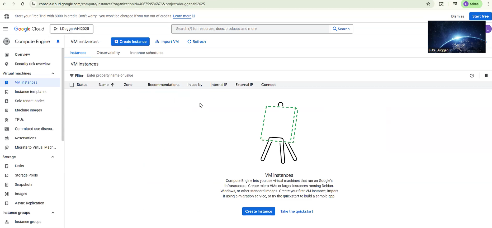
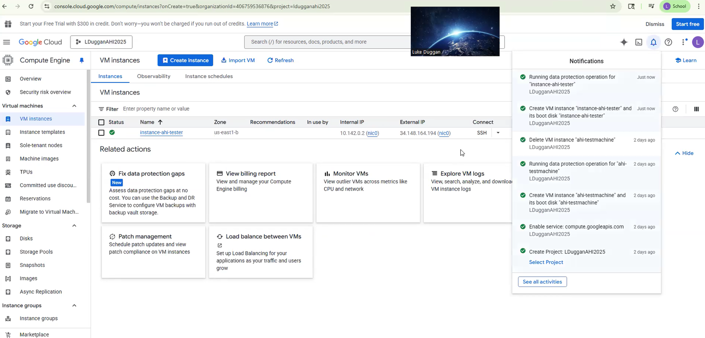
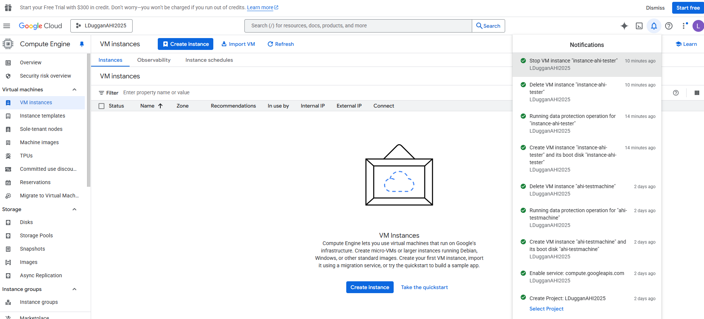
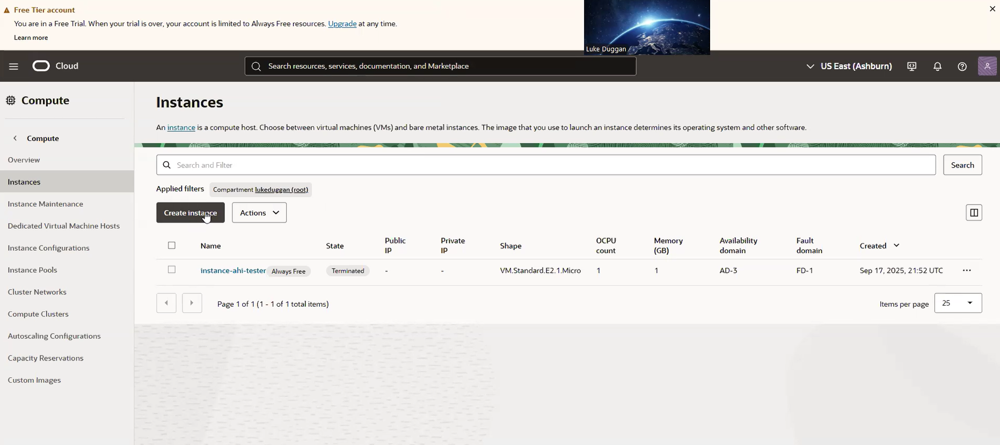
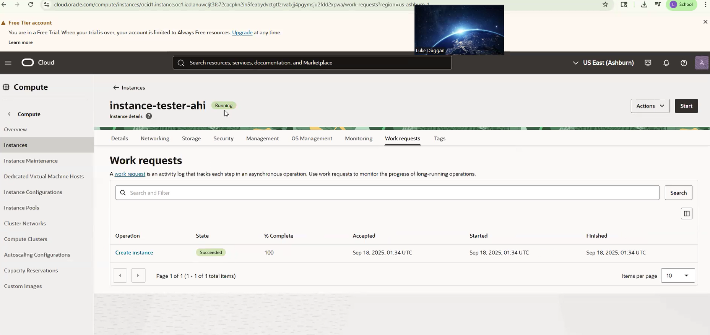
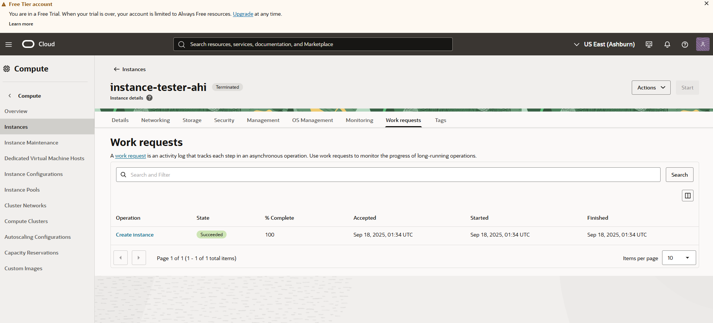

Google Cloud GCP
- First create the project
- Next go to the hamburger or menu go to the compute engine and click on vm instances
- Click create instance

- Change configuration name 
- Change region to us-east1 and zone to b
- Change machine type to e2-micro

OS and Storage
- Change operating system from debian to ubuntu and the default version
- Then go all the way to the bottom of screen and click create to create the vm instance

VM instances
- You will then wait for the instance to run

- After you see the check you now know that it is running
- To stop it click the 3 dots on the vm instance and press stop which will stop running it
- When it stops you then press the same 3 dots and click delete to terminate the vm instance

- Which will clear it from the vm instances you had available

Oracle Cloud OCI
- First go to the hamburger or menu and go to compute and click on instances
- Then click on create instance

- Next you change the name of the instance
- Scroll down to image and change the operating system from oracle linux to ubuntu
- Keep the shape as the default setting
- On the right bottom corner click next

Security
- Turn on shielded instance
- On the bottom right click next again

Networking
- Scroll to primary network and click create new virtual cloud network
- Then chnage the name of the network and keep everyting else as default
- Generate SSH keys and download the private and public key
- Click next on the bottom right

Storage
- Turn on boot volumn and leave it on the default settings
- Click next on the bottom right
- And then click create

Instances
- Wait a few minutes then refresh and then the instance should be running

- After the instance is running to stop it click actions and click stop
- Once the instance stops you click terminate and check the box to delete the attached boot volume
- Finally click terminate instance

- The instance will show that it is terminated and will completely clear in 24 hours to where you can't see it anymore